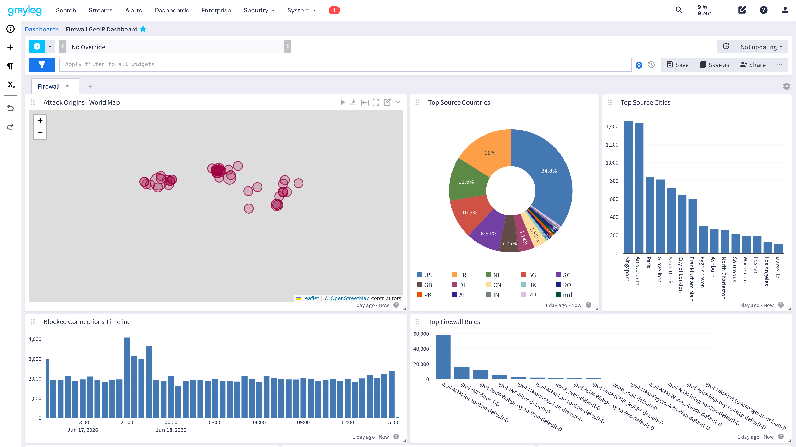
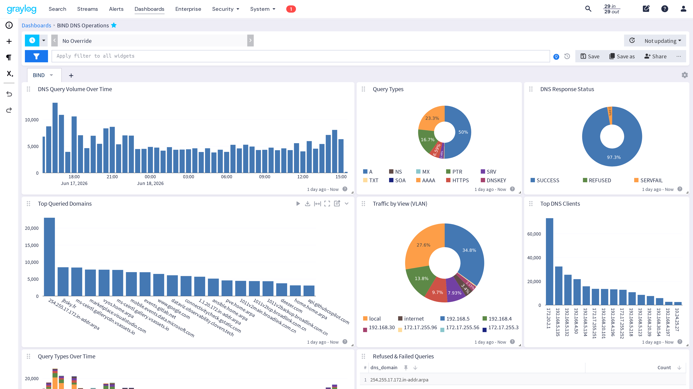
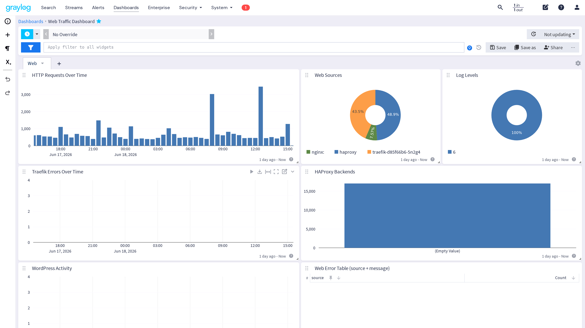
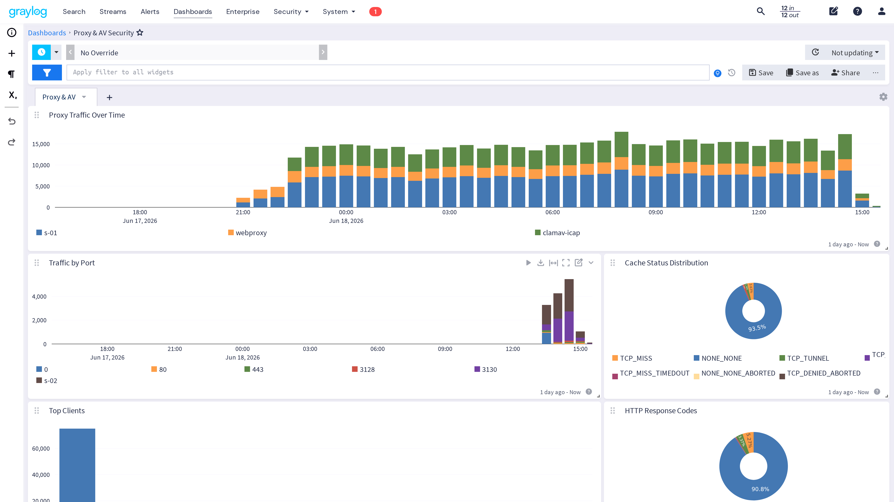
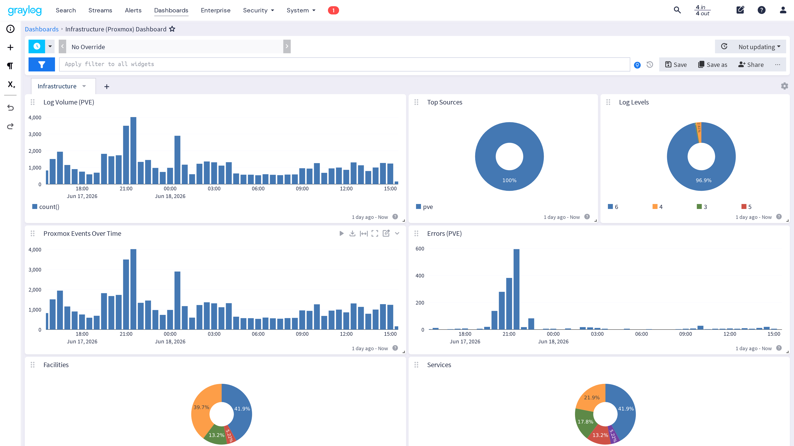
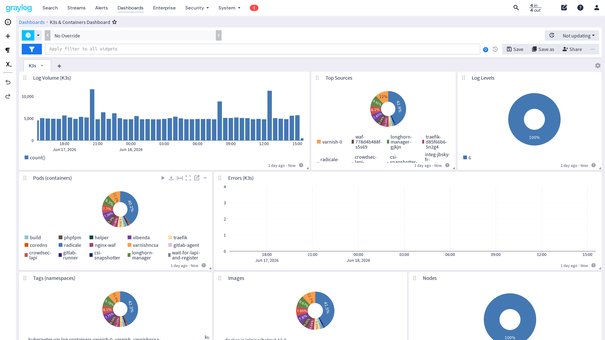
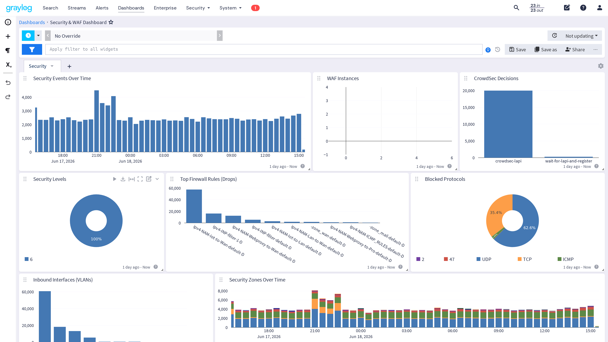
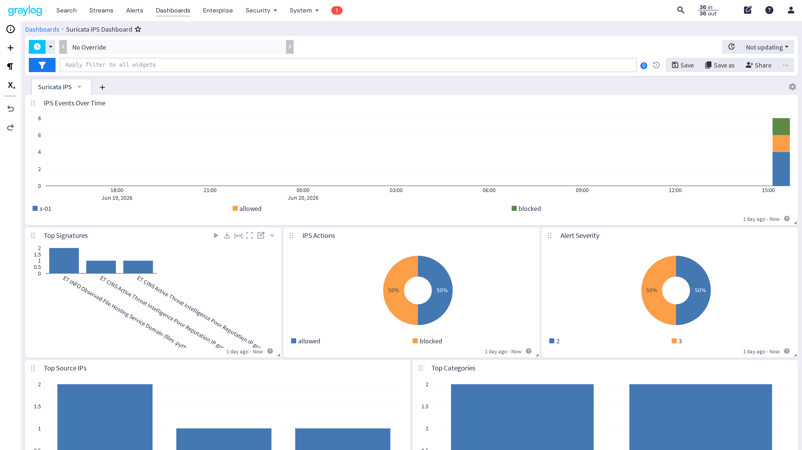

# dashboard_graylog

Ansible Galaxy role to deploy Graylog dashboards and field-extraction pipelines via the REST API.

## Features

- **Idempotent** -- only deploys dashboards/pipelines that don't already exist (matched by title)
- **Recreate mode** -- delete + redeploy all managed dashboards in one run (`graylog_dashboards_recreate: true`)
- **Self-contained** -- dashboard definitions are JSON files shipped with the role
- **Pipeline management** -- creates/updates Graylog pipelines that extract fields required by the dashboards
- **Graylog 7.x compatible** -- uses the `/api/views/search` + `/api/views/dashboards` + `/api/system/pipelines` APIs

---

## Dashboards

### Firewall GeoIP

VyOS netfilter logs enriched with MaxMind GeoIP data.



**10 widgets** -- bar charts, pies, world map, message table

### BIND DNS Operations

BIND9 query logs with view-based split-horizon analytics and GeoIP.



**13 widgets** -- bar charts, stacked timelines, pies, world map, table, message table

### Web Traffic

HTTP request logs from Traefik, HAProxy, nginx and WordPress.



**10 widgets** -- bar charts, pies, sorted tables, message table

### Proxy & AV Security

Squid multi-mode proxy (explicit + transparent IoT) with ClamAV/c-icap antivirus scanning.



**15 widgets** -- 3 stacked timelines, 7 bar charts, 4 pies, 1 message table

Port mapping (`%>lp` reports original destination port in transparent/intercept mode):
| Port | Mode | Description |
|------|------|-------------|
| `80` | Transparent HTTP | IoT VLAN, TPROXY redirect |
| `443` | Transparent HTTPS | IoT VLAN, ssl-bump peek+splice |
| `3128` | Explicit HTTP | Server proxy, direct connect |
| `3130` | Explicit SSL Bump | Server proxy, ssl-bump |

### Infrastructure (Proxmox)

Proxmox VE hypervisor syslog events.



**8 widgets** -- bar charts, pies, message table

### K3s & Containers

Kubernetes cluster and container runtime logs.



**9 widgets** -- bar charts, pies, message table

### Security & WAF

ModSecurity WAF events (via pipeline-extracted `waf_*` fields), CrowdSec decisions, and firewall drops.



**10 widgets** -- bar charts, stacked timeline, pies, message table

WAF Instances shows breakdown by `waf_hostname` (site protected by ModSecurity).

### Suricata IPS

Suricata 8 NFQUEUE inline IPS: alerts, drops, signatures, categories, protocols, GeoIP.



**12 widgets** -- stacked timeline, bar charts, pies, message table

Action mapping:
| Action | Meaning |
|--------|---------|
| `blocked` | Packet dropped by NFQUEUE verdict (rule action: `drop`) |
| `allowed` | Alert generated but packet passed (rule action: `alert`) |

---

## Pipelines

| Pipeline | Rule(s) | Extracted Fields |
|----------|---------|-----------------|
| Firewall Log Processing | Extract Firewall Fields | `source_ip`, `destination_ip`, `network_protocol`, `fw_rule`, `destination_port`, `source_port`, `src_geolocation`, `src_country`, `src_city`, `src_as_org` |
| DNS Log Processing | Extract DNS Fields | `dns_client_ip`, `dns_domain`, `dns_view`, `dns_query_type`, `dns_status`, `dns_geolocation`, `dns_country` |
| Web Log Processing | Extract Web Fields | `http_method`, `http_url`, `http_status`, `http_response_size`, `http_client_ip` |
| Proxy Log Processing | Set Proxy Source, Extract Squid Fields | `squid_client_ip`, `squid_status`, `squid_http_code`, `squid_bytes`, `squid_method`, `squid_url`, `squid_sni`, `squid_bump_mode`, `squid_port`, `icap_mode`, `icap_response_code` |
| WAF Log Processing | Extract WAF Fields | `waf_client_ip`, `waf_hostname`, `waf_uri`, `waf_method`, `waf_http_code`, `waf_interrupted`, `waf_server` |
| Suricata IPS Processing | Extract Suricata EVE Fields | `ids_event_type`, `ids_src_ip`, `ids_src_port`, `ids_dest_ip`, `ids_dest_port`, `ids_proto`, `ids_action`, `ids_signature_id`, `ids_signature`, `ids_category`, `ids_severity`, `ids_direction`, `ids_geolocation`, `ids_country` |

---

## Expected Log Formats

The pipelines expect specific log formats from each source. If the format doesn't match, field extraction will silently produce empty values.

### Squid (Proxy Log Processing)

```
# squid.conf -- local log
logformat squid_multi %ts.%03tu %6tr %>a %Ss/%03>Hs %<st %rm %ru %[un %Sh/%<a %mt %ssl::>sni %ssl::bump_mode %>lp

# squid.conf -- syslog towards Graylog (RFC3164 with custom header)
logformat syslog_multi <14>%{%b %d %H:%M:%S}tl webproxy squid[0]: %ts.%03tu %6tr %>a %Ss/%03>Hs %<st %rm %ru %[un %Sh/%<a %mt %ssl::>sni %ssl::bump_mode %>lp

access_log udp://<graylog_ip>:514 syslog_multi
access_log stdio:/var/log/squid/access.log squid_multi
```

Fields in order: `EPOCH.MS  RESPONSE_TIME  CLIENT_IP  STATUS/HTTP_CODE  BYTES  METHOD  URL  USERNAME  HIERARCHY/PEER  MIME_TYPE  SNI  BUMP_MODE  LISTEN_PORT`

### c-icap / ClamAV (Set Proxy Source)

c-icap access logs forwarded via VyOS rsyslog (`source:vyos`, matched by `c-icap[` or `clamav[` in message). The pipeline renames `source` to `clamav-icap` and extracts ICAP fields.

```
# ICAP access log format (in message body):
# HOSTNAME c-icap[PID]: TIMESTAMP, SRC DST REQMOD|RESPMOD service CODE
```

### Firewall (Firewall Log Processing)

VyOS iptables/nftables log messages containing `SRC=` and `PROTO=` keywords (standard netfilter log format).

### DNS (DNS Log Processing)

BIND9 query log format with named views:
```
client @0xHEX IP#PORT (DOMAIN): view VIEWNAME: query: DOMAIN IN TYPE +flags
```

### Web (Web Log Processing)

Three formats supported (auto-detected by source name):

```
# Traefik (CLF): IP - - [date] "METHOD URL HTTP/x.x" STATUS SIZE ...
# HAProxy: ... timers STATUS SIZE ... "METHOD URL HTTP/x.x"
# nginx: ... "METHOD URL HTTP/x.x" STATUS SIZE
```

### ModSecurity (WAF Log Processing)

ModSecurity v3 JSON audit log format. Messages are matched by the presence of `"transaction"` and `"modsecurity"` in the JSON body. The `source` field is the K8s pod name (e.g., `jbsky-fr-production-wordpress-*`).

```json
{
  "transaction": {
    "client_ip": "91.92.243.245",
    "request": { "method": "POST", "hostname": "jbsky.fr", "uri": "/wp-login.php" },
    "response": { "http_code": 503 },
    "is_interrupted": false,
    "producer": { "modsecurity": "ModSecurity v3.0.15", "components": ["OWASP_CRS/4.25.0"] }
  }
}
```

### Suricata (Suricata IPS Processing)

Suricata EVE JSON format forwarded via rsyslog `imfile` on VyOS. Messages are matched by `suricata {` and `event_type` in the message body.

```
# /config/etc/rsyslog/10-suricata.conf on VyOS
input(type="imfile" File="/var/log/suricata/eve.json" Tag="suricata" Severity="info" Facility="local6")
```

Message format in Graylog (syslog prefix + EVE JSON):
```
vyos suricata {"timestamp":"...","event_type":"alert","src_ip":"1.2.3.4","src_port":12345,
  "dest_ip":"172.20.1.10","dest_port":80,"proto":"TCP",
  "alert":{"action":"blocked","signature_id":2400014,"signature":"ET DROP Spamhaus...",
           "category":"Misc Attack","severity":2},
  "direction":"to_server","flow":{...}}
```

The pipeline uses `select_jsonpath` after stripping the `vyos suricata ` syslog prefix to extract pure JSON.

---

## Requirements

- Graylog 7.x with REST API enabled
- Ansible 2.14+
- The target host must have direct access to the Graylog API (typically `localhost:9000`)
- For GeoIP enrichment (Firewall/DNS), lookup tables must exist (managed by the graylog server role)

## Role Variables

```yaml
# Graylog API credentials
graylog_root_username: admin              # API username
vault_graylog_root_password: "changeme"   # API password (use Ansible vault)
graylog_api_url: "http://127.0.0.1:9000"  # Graylog API base URL

# Pipeline management (set false to skip)
graylog_pipelines_manage: true

# Recreate mode (delete + redeploy all dashboards)
graylog_dashboards_recreate: false

# Dashboard list (override to deploy a subset)
graylog_dashboards:
  - title: "Firewall GeoIP Dashboard"
    file: "firewall-geoip.json"
  # ...
```

## Installation

```bash
ansible-galaxy install jbsky.dashboard_graylog
```

Or in `requirements.yml`:

```yaml
roles:
  - name: jbsky.dashboard_graylog
    src: https://github.com/jbsky/dashboard-graylog
    version: main
```

## Usage

```bash
# Deploy all dashboards + pipelines
ansible-playbook site.yml --tags dashboards

# Recreate all dashboards (delete + redeploy)
ansible-playbook site.yml -e graylog_dashboards_recreate=true

# Skip pipeline management
ansible-playbook site.yml -e graylog_pipelines_manage=false
```

## Adding Custom Dashboards

1. Create a JSON file with the structure `{"dashboard": {...}, "search": {"queries": [...]}}`
2. Place it in `files/dashboards/`
3. Add an entry to `graylog_dashboards` in `defaults/main.yml`

The `state` key in the dashboard JSON must match `search.queries[0].id`.

## API Endpoints Used

| Endpoint | Method | Purpose |
|----------|--------|---------|
| `/api/system` | GET | Health check |
| `/api/dashboards` | GET | List existing dashboards |
| `/api/views/search` | POST | Create search definition |
| `/api/views/dashboards` | POST | Create dashboard view |
| `/api/views/{id}` | DELETE | Delete dashboard (recreate mode) |
| `/api/system/pipelines/pipeline` | GET/POST/PUT | Pipeline CRUD |
| `/api/system/pipelines/rule` | GET/POST/PUT | Pipeline rule CRUD |
| `/api/system/pipelines/connections` | GET/POST | Stream-pipeline connections |

## License

MIT
